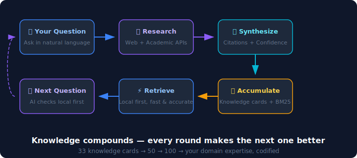

<p align="center">
  
</p>

<p align="center">
  
  
  
  
  
</p>

<p align="center">
  <a href="README.zh-CN.md">中文</a>
</p>

<p align="center">
  <strong>AI that gets smarter in YOUR domain — every question compounds.</strong><br/>
  Online research + local knowledge accumulation + MCP integration for Claude Code & VS Code Copilot.
</p>

---

## Demo

<p align="center">
  
</p>

<p align="center"><sub>Ask → Research → Accumulate → Next question hits local cache instantly</sub></p>

<p align="center">
  
</p>

Each round compounds. Knowledge cards have full lifecycle management: **draft → reviewed → trusted → stale → deprecated**.

---

## Why Scholar Agent?

| | ChatGPT / Claude | Obsidian + Plugins | Zotero | **Scholar Agent** |
|---|---|---|---|---|
| Domain knowledge accumulates | No — every chat starts fresh | Manual curation | Bibliography only | **Automatic — every query compounds** |
| Structured research with citations | Sometimes | Manual | Partial | **Yes — structured synthesis + confidence scores** |
| Academic paper pipeline | Limited | Via plugins | Yes | **Search → Score → Analyze → Extract → Recommend** |
| Works offline | No | Yes | Partial | **Yes — local BM25 index, falls back gracefully** |
| Human-readable knowledge base | Chat history | Markdown files | PDF library | **Obsidian-compatible Markdown + wiki-links** |
| Integrates with your IDE | No | No | Partial | **MCP server for Claude Code, VS Code Copilot, OpenCode** |
| Knowledge quality gates | None | None | None | **Lifecycle management + quality scoring + validation** |

---

## Quick Start

### Install

```bash
pip install py-scholar-agent
```

Or from source:

```bash
git clone https://github.com/zfy465914233/scholar-agent.git
cd scholar-agent
pip install -e .
```

### Setup

```bash
scholar-agent init
```

One command creates data directories, writes config, and registers MCP with Claude Code. You're done.

### Modes

| Mode | Command | Data Location | Scope |
|------|---------|---------------|-------|
| **Global** (recommended) | `scholar-agent init` | `~/scholar/` | Every project |
| **Project-Local** | `SCHOLAR_HOME=./scholar scholar-agent init` | `my-project/scholar/` | Current project only |
| **Docker** | `docker run -v ~/scholar:/data scholar-agent serve-mcp` | Container volume | Isolated |

---

## What It Does

### Knowledge Flywheel

Ask a question → Scholar Agent researches (web + academic APIs) → synthesizes a structured answer with citations → saves as a knowledge card → indexes it with BM25. Next time a similar question comes up, it hits the local index first — **fast, accurate, and free**.

### Academic Research Pipeline

- **Paper Search** — arXiv, DBLP, Semantic Scholar. Filter by 10+ top conferences
- **Smart Scoring** — 4-dimensional engine (relevance, recency, popularity, quality)
- **Deep Analysis** — 20+ section Obsidian-style notes with AI-assisted completion
- **Figure Extraction** — From arXiv source archives and PDFs
- **Daily Recommendations** — Automated search, scoring, deduplication
- **Paper → Knowledge Card** — Feed analyses back into the flywheel
- **Keyword Auto-Linking** — `[[wiki-links]]` across all notes

### MCP Tools

**Core** (always available): `query_knowledge` · `save_research` · `list_knowledge` · `capture_answer` · `ingest_source` · `build_graph`

**Academic** (set `SCHOLAR_ACADEMIC=1`): `search_papers` · `search_conf_papers` · `download_paper` · `analyze_paper` · `extract_paper_images` · `paper_to_card` · `daily_recommend` · `link_paper_keywords`

<details>
<summary>🔌 Claude Desktop MCP Configuration</summary>

Add this to your `claude_desktop_config.json`:
```json
{
  "mcpServers": {
    "scholar-agent": {
      "command": "scholar-agent",
      "args": ["serve-mcp"],
      "env": {
        "SCHOLAR_ACADEMIC": "1"
      }
    }
  }
}
```
</details>

---

## CLI Reference

| Command | Description |
|---------|-------------|
| `scholar-agent init` | One-command setup: data dirs + config + MCP registration |
| `scholar-agent serve-mcp` | Start the MCP server |
| `scholar-agent doctor` | Show environment and config diagnostics |
| `scholar-agent config show` | Show resolved configuration |
| `scholar-agent install claude --write` | Register MCP with Claude Code |
| `scholar-agent install vscode --write` | Register MCP with VS Code Copilot |
| `scholar-agent install opencode --write` | Register MCP with OpenCode |

---

## Configuration

### Environment Variables

| Variable | Required | Description |
|----------|----------|-------------|
| `SCHOLAR_ACADEMIC` | No | Set to `1` to enable academic tools |
| `SCHOLAR_HOME` | No | Override data directory (default: `~/scholar/`) |
| `S2_API_KEY` | No | Semantic Scholar API key ([get one free](https://api.semanticscholar.org/)) |
| `LLM_API_KEY` | No | LLM API key for advanced synthesis pipeline |

### Config File

See [`.scholar.example.json`](.scholar.example.json) for a full example with comments. Key sections:

- `knowledge_dir` — Knowledge cards directory
- `index_path` — BM25 search index
- `academic.research_interests` — Your domains, keywords, arXiv categories
- `academic.scoring` — Paper scoring weights

---

## Recommended Workflow

For best paper analysis quality:

1. **Download**: `download_paper("2510.24701", title="Paper Title", domain="LLM")`
2. **Extract images**: `extract_paper_images("2510.24701")`
3. **Deep analysis**: `analyze_paper(paper_json)`

> Downloading the PDF first enables full-text extraction, producing notes with specific data, formulas, and experimental results.

---

## Development

```bash
make dev       # Install with dev dependencies + pre-commit hooks
make lint      # Run ruff + mypy
make test      # Run test suite (276 tests, ~7s, fully offline)
make coverage  # Run tests with coverage report
make build     # Build distribution package
make docker    # Build Docker image
```

See [CONTRIBUTING.md](CONTRIBUTING.md) for detailed guidelines.

## Features at a Glance

- **Multi-perspective research** — 5 perspectives (academic, technical, applied, contrarian, historical)
- **Obsidian compatible** — Markdown + YAML frontmatter + `[[wiki-links]]`
- **Knowledge governance** — Validate frontmatter, detect orphans, find duplicates, manage lifecycle
- **Provider fault tolerance** — Each source fails independently; graceful offline fallback
- **Cross-platform** — macOS, Linux, Windows

## License

MIT — see [LICENSE](LICENSE).
