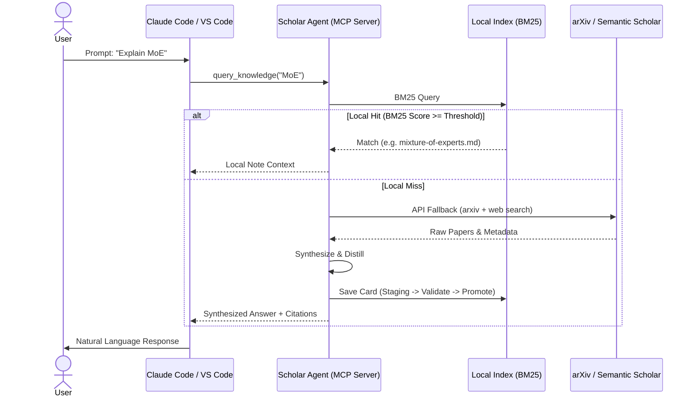

<p align="center">
  
</p>

<p align="center">
  
  
  
  
  
</p>

<p align="center">
  <a href="https://mindpulse.top">
    
  </a>
</p>

<p align="center">
  <a href="README.md">English</a> | <a href="README.zh-CN.md">简体中文</a>
</p>


<p align="center">
  <strong>AI that gets smarter in YOUR domain — every question compounds.</strong>
</p>

---

## MindPulse Academic Suite

Scholar Agent is part of the **MindPulse Academic Suite**, forming a powerful synergy between local open-source tools and fully-managed cloud services:

* 🌌 **Scholar Agent** (Open Source & Local): A local-first knowledge flywheel that integrates with your IDE via MCP (Model Context Protocol). It saves research answers as local Markdown knowledge cards, building your custom personal LLM-Wiki.
* ⚡ **[PaperPulse](https://mindpulse.top)** (Cloud SaaS): A fully-managed daily academic digest SaaS that monitors arXiv/Semantic Scholar, scores papers based on your personalized research preferences, and delivers distilled summaries straight to your WeChat or Email.

| Feature | Scholar Agent (Local) | PaperPulse (Cloud SaaS) |
| :--- | :--- | :--- |
| **Hosting & Mode** | Local MCP Server (Open Source) | Fully-Managed SaaS (Closed Source) |
| **Core Workflow** | On-demand research query & knowledge synthesis | Automated daily crawling, scoring & email/WeChat push |
| **Storage** | Local Markdown Files / Vector DB | Cloud Postgres / Managed Index |
| **IDE Integration** | Deeply integrated with Claude Code, VS Code, Cursor | Web-based Dashboard & Chatbot |
| **Pricing** | Free & Open Source | Free Tier / Premium Subscriptions |

💡 **Synergy (One-Click Local Sync)**:
* **One-Click Sync**: When your Scholar Agent MCP server is running locally, simply click the **"Import to Local Scholar Agent"** button on the PaperPulse web interface. The note will be instantly synced and written to your local `knowledge/` directory via a secure local loopback interface, bypass browser sandbox constraints and rebuild your search index automatically!
* **Manual Export**: You can also click **"Export Markdown"** to download the standard Markdown note and place it into your knowledge base directory manually.


---

## Why

Every AI conversation generates knowledge — research findings, technical explanations, citations. But LLMs are stateless: each new session starts from zero. The research your AI completed yesterday is not available today.

Scholar Agent makes AI knowledge persistent. It saves research and answers as local knowledge cards — structured, citable, and interconnected. Before answering, the AI checks existing local knowledge first, building on what it has already learned rather than starting from scratch each time.

The result is a personal **LLM-Wiki**: structured, traceable, continuously growing — making your AI increasingly accurate in the domains you care about.

---

## Demo

<p align="center">
  
</p>

<p align="center"><sub>Ask → Research → Save as knowledge card → Knowledge compounds over time</sub></p>

---

## What It Does

### Architecture & Data Flow

When you ask a question, the agent routes the query through a local-first retrieval loop before falling back to external sources:



### Knowledge Persistence

Each conversation can produce a knowledge card — a structured record with:

- The question asked
- Evidence-backed answer with citations
- Confidence scores and uncertainty flags
- Source references you can trace back

These cards accumulate into a searchable local knowledge base. Next time a similar question comes up, the AI draws from what's already been researched.

### Knowledge Network

Cards aren't isolated files. Scholar Agent:

- Maintains a **quality lifecycle** for each card: `draft → reviewed → trusted → stale → deprecated`
- Auto-generates **`[[wiki-links]]`** between related cards
- Tracks **provenance** — every claim links back to its source evidence
- Outputs **Obsidian-compatible** Markdown (YAML frontmatter + wiki-links)
- **Obsidian Graph Ready** — Open your data directory (e.g. `~/scholar/`) directly as an Obsidian Vault to navigate your visual knowledge graph.

### Evidence-Based Answers

When researching a question, Scholar Agent:

1. **Searches** local knowledge (BM25 keyword index)
2. **Falls back** to web and academic APIs when local knowledge is insufficient
3. **Synthesizes** answers where every claim cites its source
4. **Flags** claims that lack supporting evidence
5. **Returns** structured results with confidence levels and suggested next steps

### Academic Research Pipeline

For paper research, Scholar Agent provides:

- **Paper Search** — arXiv, DBLP, Semantic Scholar with 10+ top-conference filters
- **Smart Scoring** — 4-dimensional ranking: relevance, recency, popularity, quality
- **Deep Analysis** — 20+ section structured notes with AI-assisted completion
- **Figure Extraction** — From arXiv source archives and PDFs
- **Daily Recommendations** — Dual-track: 2 top-conference papers + 2 arXiv innovation papers
- **Paper → Knowledge Card** — Feed analyses back into the knowledge base

---

## Quick Start

### Install

```bash
pip install py-scholar-agent
```

Or with pipx (isolated environment):

```bash
pipx install py-scholar-agent
```

Or from source:

```bash
git clone https://github.com/zfy465914233/scholar-agent.git
cd scholar-agent
pip install -e .
```

### Setup

```bash
scholar-agent init
```

One command creates data directories, writes config, and registers MCP with Claude Code. Done.

### Modes

| Mode | Command | Data Location | Scope |
|------|---------|---------------|-------|
| **Global** (recommended) | `scholar-agent init` | `~/scholar/` | Every project |
| **Project-Local** | `SCHOLAR_HOME=./scholar scholar-agent init` | `my-project/scholar/` | Current project only |
| **Docker** | `docker run -v ~/scholar:/data scholar-agent serve-mcp` | Container volume | Isolated |

---

## MCP Integration

Scholar Agent runs as an MCP server, integrating directly into your tools:

- **Claude Code** — `scholar-agent install claude --write`
- **VS Code Copilot** — `scholar-agent install vscode --write`
- **OpenCode** — `scholar-agent install opencode --write`

**Core tools** (always available): `query_knowledge` · `save_research` · `list_knowledge` · `capture_answer` · `ingest_source` · `build_graph`

**Academic tools** (set `SCHOLAR_ACADEMIC=1`): `search_papers` · `search_conf_papers` · `download_paper` · `analyze_paper` · `extract_paper_images` · `paper_to_card` · `daily_recommend` · `link_paper_keywords`

<details>
<summary>Claude Desktop MCP Configuration</summary>

Add this to your `claude_desktop_config.json`:
```json
{
  "mcpServers": {
    "scholar-agent": {
      "command": "scholar-agent",
      "args": ["serve-mcp"],
      "env": {
        "SCHOLAR_ACADEMIC": "1"
      }
    }
  }
}
```
</details>

---

## Local Retrieval

Knowledge is indexed with **BM25** for fast keyword search — no external dependencies required. An optional **embedding** layer can be enabled for semantic similarity with `scholar-agent index --build-embedding-index`.

---

## CLI Reference

| Command | Description |
|---------|-------------|
| `scholar-agent init` | One-command setup: data dirs + config + MCP registration |
| `scholar-agent serve-mcp` | Start the MCP server |
| `scholar-agent doctor` | Show environment and config diagnostics |
| `scholar-agent config show` | Show resolved configuration |
| `scholar-agent install claude --write` | Register MCP with Claude Code |
| `scholar-agent install vscode --write` | Register MCP with VS Code Copilot |
| `scholar-agent install opencode --write` | Register MCP with OpenCode |

---

## Configuration

### Environment Variables

| Variable | Required | Description |
|----------|----------|-------------|
| `SCHOLAR_ACADEMIC` | No | Set to `1` to enable academic tools |
| `SCHOLAR_HOME` | No | Override data directory (default: `~/scholar/`) |
| `S2_API_KEY` | No | Semantic Scholar API key ([get one free](https://api.semanticscholar.org/)) |
| `LLM_API_KEY` | No | LLM API key for advanced synthesis pipeline |

### Config File

See [`.scholar.example.json`](.scholar.example.json) for a full example. Key sections:

- `knowledge_dir` — Knowledge cards directory
- `index_path` — BM25 search index
- `academic.research_interests` — Your domains, keywords, arXiv categories
- `academic.scoring` — Paper scoring weights

### Data Directory

```
scholar/
├── config/         # Configuration files
├── knowledge/      # Knowledge cards
├── paper-notes/    # Paper analysis notes
├── daily-notes/    # Daily paper recommendations
├── indexes/        # BM25 search index
├── cache/          # Cached data
└── outputs/        # Generated outputs
```

---

## Recommended Workflow

### Daily research flow

```
Ask a question (via MCP)
  → Scholar Agent searches local knowledge first
  → Falls back to web/academic APIs when needed
  → Synthesizes answer with citations
  → Saves as a knowledge card
  → Next similar question draws from local knowledge
```

### Paper analysis flow

For best paper analysis quality:

1. **Download**: `download_paper("2510.24701", title="Paper Title", domain="LLM")`
2. **Extract images**: `extract_paper_images("2510.24701")`
3. **Deep analysis**: `analyze_paper(paper_json)`
4. **Feed into knowledge base**: `paper_to_card(paper_json)`

> Downloading the PDF first enables full-text extraction, producing notes with specific data, formulas, and experimental results.

---

## Development

```bash
make dev       # Install with dev dependencies + pre-commit hooks
make lint      # Run ruff + mypy
make test      # Run test suite (1121 tests, ~20s, fully offline)
make coverage  # Run tests with coverage report
make build     # Build distribution package
make docker    # Build Docker image
```

See [CONTRIBUTING.md](CONTRIBUTING.md) for detailed guidelines.

## Highlights

- **Knowledge persistence** — Every conversation can produce a reusable knowledge card; the local knowledge base grows over time
- **Evidence-based** — Every claim cites its source, with confidence scores and uncertainty flags
- **Quality lifecycle** — Cards are validated, scored, promoted, and deprecated. Full provenance tracking
- **Knowledge network** — Wiki-links connect related cards into a navigable knowledge graph
- **Obsidian compatible** — Markdown + YAML frontmatter + `[[wiki-links]]`. Your data, no lock-in
- **Academic pipeline** — Search → Score → Analyze → Extract → Recommend, fully automated
- **MCP integration** — Works with Claude Code, VS Code Copilot, and OpenCode out of the box
- **Offline-first** — Local BM25 index, graceful degradation when external APIs are unavailable

## Comparison

Wondering how Scholar Agent compares to mem0, MemGPT, or Zep? See [docs/comparison.md](docs/comparison.md) for a detailed breakdown.

## License

MIT — see [LICENSE](LICENSE).
