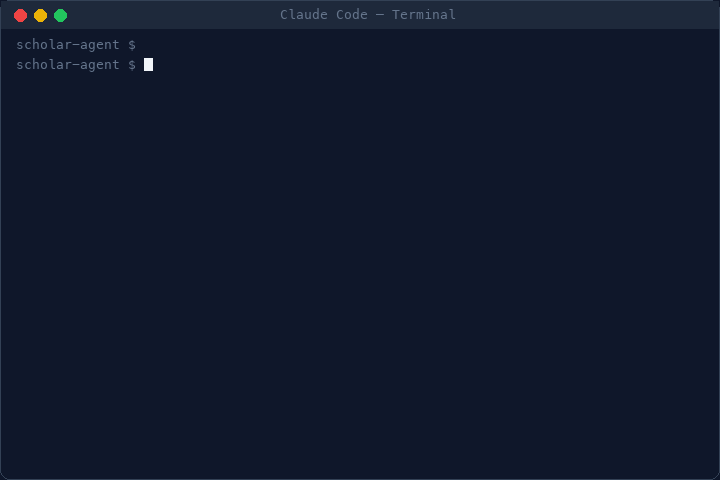
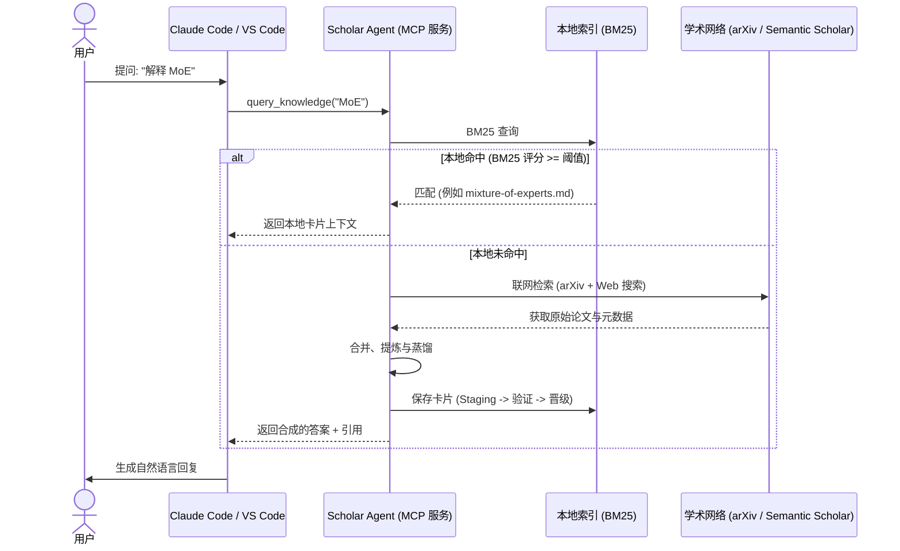

# Scholar Agent


[English](README.md)

---

## 为什么需要 Scholar Agent

每次与 AI 对话都在产生知识——研究结论、技术解答、文献引用。但大模型是无状态的，下一次对话从零开始。昨天 AI 为你完成的研究，今天无法复用。

Scholar Agent 让 AI 知识持久化。它将对话中的研究和答案保存为本地知识卡片——结构化、可引用、相互链接。AI 在回答前优先查询已有的本地知识，在已有积累的基础上不断丰富。

最终形成的是一个属于你的 **LLM-Wiki**：结构化、可溯源、持续增长——让 AI 在你关注的领域越来越准确。

---

<p align="center">
  
</p>

<p align="center"><sub>提问 → 研究 → 沉淀为知识卡片 → 知识持续积累</sub></p>

---

## 做了什么

### 架构与数据流

当您提出问题时，Agent 会在回退到外部源之前，通过本地优先的检索循环来路由查询：



### 知识持久化

每次对话都可以产生一张知识卡片——结构化记录包含：

- 提出的问题
- 带引用来源的证据支撑答案
- 置信度评分与不确定性标记
- 可追溯的来源引用

这些卡片累积为可搜索的本地知识库。下次遇到类似问题，AI 直接从已有研究中获取答案。

### 知识网络

卡片不是孤立文件。Scholar Agent：

- 为每张卡片维护**质量生命周期**：`draft → reviewed → trusted → stale → deprecated`
- 自动生成 **`[[wiki-links]]`**，连接相关卡片
- 追踪**来源**——每个论断都能回溯到原始证据
- 输出 **Obsidian 兼容**的 Markdown（YAML frontmatter + wiki-links）
- **Obsidian 知识图谱开箱即用** —— 您可以直接将数据目录（例如 `~/scholar/`）作为 Obsidian 库（Vault）打开，从而直接导航和探索可视化的知识图谱。

### 基于证据的答案

研究一个问题时，Scholar Agent：

1. **搜索**本地知识（BM25 关键词索引）
2. **不足时**调用网络和学术 API 补充
3. **合成**答案——每个论断都有引用来源
4. **标记**缺乏证据支撑的论断
5. **返回**结构化结果——含置信度和建议的下一步

### 学术研究管线

针对论文研究，Scholar Agent 提供：

- **论文搜索** — arXiv、DBLP、Semantic Scholar，支持 10+ 顶会过滤
- **智能评分** — 四维排名：相关性、时效性、影响力、质量
- **深度分析** — 20+ 章节结构化笔记，AI 辅助补全
- **图片提取** — 从 arXiv 源包和 PDF 中提取论文图表
- **每日推荐** — 双轨模式：2 篇顶会论文 + 2 篇 arXiv 创新论文
- **论文 → 知识卡片** — 将分析结果反哺知识库

---

## 快速开始

### 安装

```bash
pip install py-scholar-agent
```

或从源码安装：

```bash
git clone https://github.com/zfy465914233/scholar-agent.git
cd scholar-agent
pip install -e .
```

### 初始化

```bash
scholar-agent init
```

一条命令创建数据目录、写入配置、注册 MCP 到 Claude Code。搞定。

### 模式

| 模式 | 命令 | 数据位置 | 作用域 |
|------|------|---------|--------|
| **全局**（推荐） | `scholar-agent init` | `~/scholar/` | 所有项目 |
| **项目级** | `SCHOLAR_HOME=./scholar scholar-agent init` | `my-project/scholar/` | 仅当前项目 |
| **Docker** | `docker run -v ~/scholar:/data scholar-agent serve-mcp` | 容器卷 | 隔离环境 |

---

## MCP 集成

Scholar Agent 作为 MCP 服务器运行，直接接入你的工具：

- **Claude Code** — `scholar-agent install claude --write`
- **VS Code Copilot** — `scholar-agent install vscode --write`
- **OpenCode** — `scholar-agent install opencode --write`

**核心工具**（始终可用）：`query_knowledge` · `save_research` · `list_knowledge` · `capture_answer` · `ingest_source` · `build_graph`

**学术工具**（设置 `SCHOLAR_ACADEMIC=1` 启用）：`search_papers` · `search_conf_papers` · `download_paper` · `analyze_paper` · `extract_paper_images` · `paper_to_card` · `daily_recommend` · `link_paper_keywords`

<details>
<summary>Claude Desktop MCP 配置示例</summary>

将以下内容添加到 `claude_desktop_config.json`：
```json
{
  "mcpServers": {
    "scholar-agent": {
      "command": "scholar-agent",
      "args": ["serve-mcp"],
      "env": {
        "SCHOLAR_ACADEMIC": "1"
      }
    }
  }
}
```
</details>

---

## 本地检索

知识通过 **BM25** 建立索引，支持快速关键词搜索——无需外部依赖。可选启用 **embedding** 语义检索层，通过 `scholar-agent index --build-embedding-index` 构建。

---

## CLI 命令参考

| 命令 | 说明 |
|------|------|
| `scholar-agent init` | 一键设置：数据目录 + 配置 + MCP 注册 |
| `scholar-agent serve-mcp` | 启动 MCP 服务器 |
| `scholar-agent doctor` | 查看环境与配置诊断信息 |
| `scholar-agent config show` | 显示解析后的配置 |
| `scholar-agent install claude --write` | 注册 MCP 到 Claude Code |
| `scholar-agent install vscode --write` | 注册 MCP 到 VS Code Copilot |
| `scholar-agent install opencode --write` | 注册 MCP 到 OpenCode |

---

## 配置

### 环境变量

| 变量 | 必需 | 说明 |
|------|------|------|
| `SCHOLAR_ACADEMIC` | 否 | 设为 `1` 启用学术工具 |
| `SCHOLAR_HOME` | 否 | 覆盖数据目录（默认 `~/scholar/`） |
| `S2_API_KEY` | 否 | Semantic Scholar API key（[免费申请](https://api.semanticscholar.org/)） |
| `LLM_API_KEY` | 否 | LLM API key（用于高级合成管线） |

### 配置文件

完整示例见 [`.scholar.example.json`](.scholar.example.json)。主要配置项：

- `knowledge_dir` — 知识卡片目录路径
- `index_path` — BM25 搜索索引路径
- `academic.research_interests` — 研究领域、关键词和 arXiv 分类
- `academic.scoring` — 论文评分权重

### 数据目录

```
scholar/
├── config/         # 配置文件
├── knowledge/      # 知识卡片
├── paper-notes/    # 论文分析笔记
├── daily-notes/    # 每日论文推荐
├── indexes/        # BM25 搜索索引
├── cache/          # 缓存数据
└── outputs/        # 生成输出
```

---

## 推荐工作流

### 日常研究流

```
提问（通过 MCP）
  → Scholar Agent 先搜索本地知识
  → 本地知识不足时调用网络/学术 API
  → 合成带引用的结构化答案
  → 保存为知识卡片
  → 下次类似问题直接从本地知识库获取答案
```

### 论文分析流

为获得最佳分析质量：

1. **下载**：`download_paper("2510.24701", title="Paper Title", domain="LLM")`
2. **提取图片**：`extract_paper_images("2510.24701")`
3. **深度分析**：`analyze_paper(paper_json)`
4. **沉淀到知识库**：`paper_to_card(paper_json)`

> 在分析前下载 PDF 可以启用全文提取，生成包含具体数据、公式和实验结果的高质量笔记。

---

## 开发

```bash
make dev       # 安装开发依赖 + pre-commit hooks
make lint      # 运行 ruff + mypy
make test      # 运行测试（1117 个测试，约 20 秒，完全离线）
make coverage  # 运行测试并生成覆盖率报告
make build     # 构建分发包
make docker    # 构建 Docker 镜像
```

详见 [CONTRIBUTING.md](CONTRIBUTING.md)。

## 亮点

- **知识持久化** — 每次对话都可以产生可复用的知识卡片，本地知识库持续增长
- **基于证据** — 每个论断都有引用来源，附置信度评分和不确定性标记
- **质量生命周期** — 卡片被校验、评分、提升，最终标记为过时。完整的来源追踪
- **知识网络** — Wiki-links 连接相关卡片，构建可导航的知识图谱
- **Obsidian 兼容** — 标准 Markdown + YAML frontmatter + `[[wiki-links]]`。数据是你的，无锁定
- **学术管线** — 搜索 → 评分 → 分析 → 提取 → 推荐，全自动
- **MCP 集成** — 开箱即用支持 Claude Code、VS Code Copilot、OpenCode
- **离线优先** — 本地 BM25 索引，外部 API 不可用时优雅降级

## 许可证

MIT — 见 [LICENSE](LICENSE)。
