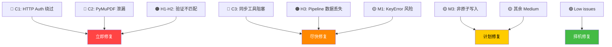

# Scholar-Agent 深度代码审计报告

> [!IMPORTANT]
> 本报告基于两轮独立的自动化审计 + 人工验证，涵盖安全漏洞、资源泄漏、逻辑错误、性能瓶颈和架构问题。

---

## 严重度统计

| 严重度 | 数量 | 说明 |
|--------|------|------|
| 🔴 Critical | 3 | 安全漏洞 + 资源泄漏 |
| 🟠 High | 3 | 数据验证失败 + 数据丢失风险 |
| 🟡 Medium | 11 | 性能问题 + 逻辑不一致 |
| 🟢 Low | 8 | 代码质量 + 潜在小问题 |

---

## 🔴 Critical Issues

### C1. HTTP Server 无 Origin 请求绕过认证

**文件:** [server.py](file:///Users/zhoufangyi/scholar-agent/src/scholar_agent/server.py#L1618-L1623)

```python
# line 1622
if origin is None:
    is_local_origin = True  # ← 任何无 Origin 的请求被视为本地！
```

**问题:** 当未配置 `paperpulse_token` 时，不带 `Origin` header 的请求（如 `curl`、命令行工具、任意本地进程）直接通过认证。结合 `host_header` 检查（也可伪造），攻击者可通过 `/import-markdown` 写入任意 markdown 文件。

**影响:** 任意文件写入到 paper-notes 目录

**修复方案:** 改为检查 `self.client_address[0]` (实际 peer IP) 而非信任 Origin header：
```python
if origin is None:
    is_local_origin = self.client_address[0] in ("127.0.0.1", "::1")
```

---

### C2. PyMuPDF 文档句柄泄漏 (2处)

**文件:** [image_extractor.py](file:///Users/zhoufangyi/scholar-agent/src/scholar_agent/engine/academic/image_extractor.py#L222-L229)

```python
# extract_pdf_text() line 222-224
doc = fitz.open(pdf_path)
chunks = [page.get_text() for page in doc]  # ← 如果这里抛异常
doc.close()  # ← 永远不会执行
```

**文件:** [image_extractor.py](file:///Users/zhoufangyi/scholar-agent/src/scholar_agent/engine/academic/image_extractor.py#L313-L340)

```python
# _pull_embedded_images() line 313-340
doc = fitz.open(pdf_path)
for pg_idx in range(len(doc)):
    # ... doc.extract_image(xref) can throw ...
doc.close()  # ← 仅成功路径才执行
```

**影响:** 文件句柄和 mmap 内存泄漏；大量 PDF 处理后可能导致 fd 耗尽

**修复方案:** 使用 `with fitz.open(pdf_path) as doc:` 上下文管理器

---

### C3. 13/15 个 MCP 工具是同步函数，阻塞事件循环

**文件:** [server.py](file:///Users/zhoufangyi/scholar-agent/src/scholar_agent/server.py)

15 个 `@tool` 注册的函数中，只有 `download_paper`（line 952）和 `daily_recommend`（line 1218）是 `async` 的。其余 13 个同步工具在执行 IO 密集操作时会阻塞整个 asyncio 事件循环：

| 工具 | 阻塞操作 | 预计耗时 |
|------|----------|----------|
| `analyze_paper` (L761) | PDF 下载 + LLM 调用 + 文件写入 | 数分钟 |
| `extract_paper_images` (L1051) | arXiv tarball 下载 + 解压 | 30s+ |
| `search_arxiv_papers` (L578) | HTTP 请求 arXiv API | 5-30s |
| `search_conf_papers` (L663) | HTTP 请求 DBLP/S2 API | 5-30s |
| `save_research` (L132) | 知识卡片创建 + 文件写入 | 数秒 |
| `link_paper_keywords` (L1403) | 扫描并修改多个 md 文件 | 数秒 |
| `import_paperpulse_note` (L1491) | HTTP + 文件写入 | 数秒 |

**影响:** 当一个工具在执行 PDF 下载（timeout=300s），其他工具请求完全卡住

**修复方案:** 对所有 IO 密集工具使用 `async def` + `await asyncio.to_thread()`

---

## 🟠 High Issues

### H1. `CONFIDENCE_LEVELS` 不包含 `"draft"` — 每张自动生成的卡片都验证失败

**文件:** [knowledge_lifecycle.py](file:///Users/zhoufangyi/scholar-agent/src/scholar_agent/engine/knowledge_lifecycle.py#L52)
**文件:** [close_knowledge_loop.py](file:///Users/zhoufangyi/scholar-agent/src/scholar_agent/engine/close_knowledge_loop.py#L525)

```python
# knowledge_lifecycle.py:52
CONFIDENCE_LEVELS = {"confirmed", "likely", "unknown"}

# close_knowledge_loop.py:525  
"confidence: draft",  # ← 不在 CONFIDENCE_LEVELS 中！
```

**影响:** 所有 `build_knowledge_card()` 生成的卡片在 `validate_card()` 时都会得到 "Invalid confidence 'draft'" 错误

**修复方案:** 将 `"draft"` 加入 `CONFIDENCE_LEVELS`

---

### H2. `ORIGINS` 不包含 `"web_research_with_synthesis"`

**文件:** [knowledge_lifecycle.py](file:///Users/zhoufangyi/scholar-agent/src/scholar_agent/engine/knowledge_lifecycle.py#L53)
**文件:** [close_knowledge_loop.py](file:///Users/zhoufangyi/scholar-agent/src/scholar_agent/engine/close_knowledge_loop.py#L527)

```python
# knowledge_lifecycle.py:53
ORIGINS = {"local_seed", "manual_web_research", "distilled", "promoted", "imported"}

# close_knowledge_loop.py:527
"origin: web_research_with_synthesis",  # ← 不在 ORIGINS 中！
```

**影响:** 所有自动生成的卡片都会收到 "Unrecognized origin" 警告

**修复方案:** 将 `"web_research_with_synthesis"` 加入 `ORIGINS`

---

### H3. Dual-track pipeline 一个 track 失败导致全部数据丢失

**文件:** [daily_workflow.py](file:///Users/zhoufangyi/scholar-agent/src/scholar_agent/engine/academic/daily_workflow.py#L262-L299)

```python
# line 262-283 — 无 try/except 包裹
conf_result = _generate_track_conference(...)   # ← 如果这里成功
arxiv_result = _generate_track_arxiv_innovation(...)  # ← 但这里抛异常
# 则 conf_result 的数据也全部丢失
```

**影响:** 一个 track 的网络/API 错误会导致另一个 track 的有效结果全部丢失

**修复方案:** 用 try/except 分别包裹每个 track，返回部分结果

---

## 🟡 Medium Issues

### M1. `retrieve_bm25()` 直接 key 访问可能 KeyError

**文件:** [local_retrieve.py](file:///Users/zhoufangyi/scholar-agent/src/scholar_agent/engine/local_retrieve.py#L89-L95)

```python
"doc_id": doc["doc_id"],   # ← 如果缺少字段 → KeyError
"path": doc["path"],
"title": doc["title"],
"type": doc["type"],
"topic": doc["topic"],
```

对比 `retrieve_hybrid()` 在 line 178-185 正确使用了 `doc.get("path", "")`。不一致的字段访问方式。

---

### M2. Embedding index 每次查询从磁盘完整加载

**文件:** [local_retrieve.py](file:///Users/zhoufangyi/scholar-agent/src/scholar_agent/engine/local_retrieve.py#L208-L209)

```python
embedding_index = json.loads(Path(embedding_index_path).read_text(...))
```

大型 embedding index 每次调用 `retrieve()` 都从磁盘完整反序列化，无缓存。

---

### M3. 非原子文件写入（8+ 处）

多处关键文件写入使用直接写入而非 write-to-temp-then-rename 模式：

| 文件 | 行号 | 风险 |
|------|------|------|
| [close_knowledge_loop.py](file:///Users/zhoufangyi/scholar-agent/src/scholar_agent/engine/close_knowledge_loop.py#L731) | 731 | 知识卡片 |
| [local_index.py](file:///Users/zhoufangyi/scholar-agent/src/scholar_agent/engine/local_index.py#L363) | 363 | **索引文件** (最危险) |
| [daily_workflow.py](file:///Users/zhoufangyi/scholar-agent/src/scholar_agent/engine/academic/daily_workflow.py#L568) | 568 | 每日笔记 |
| [import_service.py](file:///Users/zhoufangyi/scholar-agent/src/scholar_agent/engine/import_service.py#L86) | 86 | 导入文件 |

进程崩溃可能导致截断/损坏的文件，尤其是索引文件损坏会导致整个搜索不可用。

---

### M4. `Content-Length` 解析无异常处理

**文件:** [server.py](file:///Users/zhoufangyi/scholar-agent/src/scholar_agent/server.py#L1585)

```python
content_length = int(self.headers.get('Content-Length', 0))
# ← 如果 Content-Length 是非数字值 → 未捕获的 ValueError
```

---

### M5. `import_paperpulse_note` 使用空 `index_path`

**文件:** [server.py](file:///Users/zhoufangyi/scholar-agent/src/scholar_agent/server.py#L1506-L1509)

```python
index_path = Path(config.get("index_path", ""))
# ← 如果 config 中 index_path 为空 → Path("") 解析为当前工作目录
```

---

### M6. `capture_answer` 没有 `language` 参数

**文件:** [server.py](file:///Users/zhoufangyi/scholar-agent/src/scholar_agent/server.py#L346-L406)

`save_research` 接受 `language` 参数（line 133），但 `capture_answer` 不接受。生成的卡片始终默认 `language: "zh"`，即使内容是英文。

---

### M7. `get_analyzed_paper_ids()` 在 dual-track 中被重复调用

**文件:** [daily_workflow.py](file:///Users/zhoufangyi/scholar-agent/src/scholar_agent/engine/academic/daily_workflow.py#L150)
**文件:** [daily_workflow.py](file:///Users/zhoufangyi/scholar-agent/src/scholar_agent/engine/academic/daily_workflow.py#L192)

两个 track 函数各自独立扫描 paper-notes 目录，相同的目录被扫描两次。

---

### M8. `generate_paper_notes_for_daily()` 静默吞掉笔记生成失败

**文件:** [daily_workflow.py](file:///Users/zhoufangyi/scholar-agent/src/scholar_agent/engine/academic/daily_workflow.py#L485-L489)

```python
except Exception:
    logger.warning(...)  # ← 仅日志记录，用户完全不知道哪些论文失败了
```

---

### M9. `transition_card()` 从未被调用 — 死代码

**文件:** [knowledge_lifecycle.py](file:///Users/zhoufangyi/scholar-agent/src/scholar_agent/engine/knowledge_lifecycle.py#L141-L163)

定义了完整的状态转换逻辑（draft→reviewed→trusted→stale），但全代码库中没有任何地方调用这个函数。卡片永远停留在 `draft` 状态。

---

### M10. Wiki-link `safe_slug` 可能不匹配已有卡片 ID

**文件:** [close_knowledge_loop.py](file:///Users/zhoufangyi/scholar-agent/src/scholar_agent/engine/close_knowledge_loop.py#L682-L687)

实体提取后通过 `safe_slug(entity)` 生成 wiki-link，但不检查是否存在匹配的卡片，可能创建指向不存在卡片的断链。

---

### M11. urllib response 未正确关闭

**文件:** [image_extractor.py](file:///Users/zhoufangyi/scholar-agent/src/scholar_agent/engine/academic/image_extractor.py#L129-L131)

```python
resp = _url_lib.urlopen(req, timeout=timeout)
return getattr(resp, "status", 200), resp.read()
# ← resp 未被 close()，socket 连接未释放
```

---

## 🟢 Low Issues

### L1. BM25 cache 全清策略
[local_retrieve.py:40-41](file:///Users/zhoufangyi/scholar-agent/src/scholar_agent/engine/local_retrieve.py#L40-L41) — cache 超 4 项时全部清空，应改为 LRU。

### L2. CJK 正则缺少日韩字符
[bm25.py:14](file:///Users/zhoufangyi/scholar-agent/src/scholar_agent/engine/bm25.py#L14) — 仅覆盖中文，缺少 Hiragana/Katakana/Hangul。

### L3. `/import-markdown` 重复调用 `load_config()`
[server.py:1601,1652](file:///Users/zhoufangyi/scholar-agent/src/scholar_agent/server.py#L1601) — 两次从磁盘加载配置。

### L4. `analyze_paper` 返回完整 PDF 文本
[server.py:938](file:///Users/zhoufangyi/scholar-agent/src/scholar_agent/server.py#L938) — 几万字的 `pdf_text` 被塞进 JSON 响应，可能超 MCP 消息大小限制。

### L5. arXiv tar 文件未清理
[image_extractor.py:147-148](file:///Users/zhoufangyi/scholar-agent/src/scholar_agent/engine/academic/image_extractor.py#L147-L148) — 下载的 tar 文件不删除，但注意外层使用了 `TemporaryDirectory`，所以实际会清理。✅ (非问题)

### L6. `transition_card()` 就地修改输入 dict
[knowledge_lifecycle.py:162](file:///Users/zhoufangyi/scholar-agent/src/scholar_agent/engine/knowledge_lifecycle.py#L162) — 修改了调用方的 dict 引用，可能引起副作用。

### L7. `note_linker.py` 读-改-写无锁保护
并发运行时一个进程的修改可能被另一个进程覆盖。

### L8. `fastmcp>=2.0` 无上界
[pyproject.toml](file:///Users/zhoufangyi/scholar-agent/pyproject.toml) — 未来 fastmcp 3.0 的破坏性变更会导致无警告失败。

---

## 建议修复优先级



### 第一批（立即修复 — 安全 + 数据完整性）
1. C1: HTTP auth bypass → 检查 peer IP
2. C2: PyMuPDF 泄漏 → `with` 语句
3. H1 + H2: 验证常量不匹配 → 更新 `CONFIDENCE_LEVELS` 和 `ORIGINS`
4. M4: Content-Length 解析 → try/except

### 第二批（尽快修复 — 可靠性）
5. H3: Dual-track 异常隔离 → try/except 包裹
6. M1: KeyError 风险 → `.get()` 统一
7. C3: 同步工具 → async 化（工作量最大）

### 第三批（计划修复 — 性能 + 质量）
8. M3: 原子写入 → write-to-temp-then-rename
9. M2: Embedding 缓存
10. 其余 Medium + Low 问题
